## DB DESING

- obtained using sequelize

## APIs

### POST /USER

- 
- 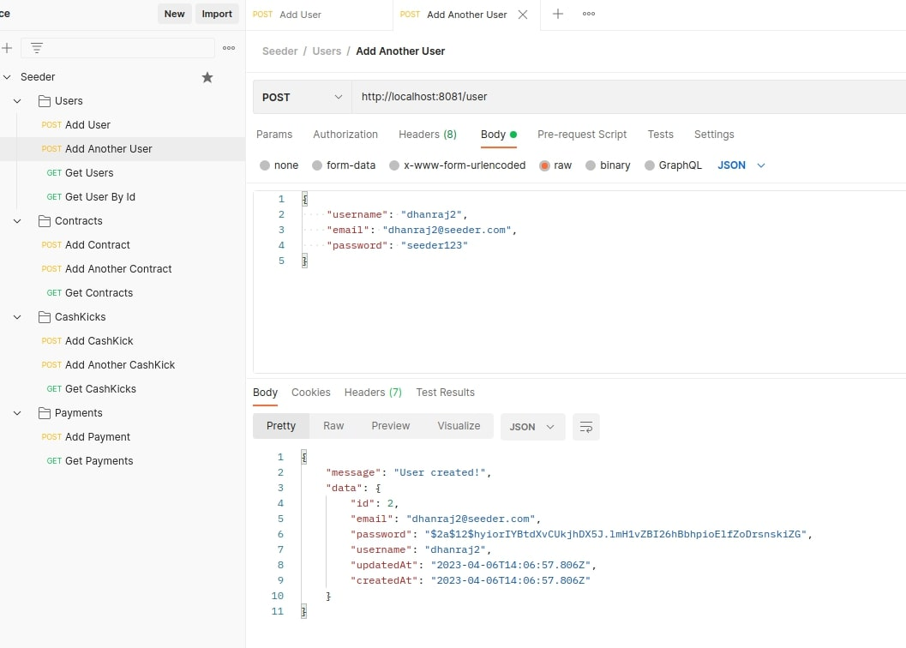

### GET /USER

- 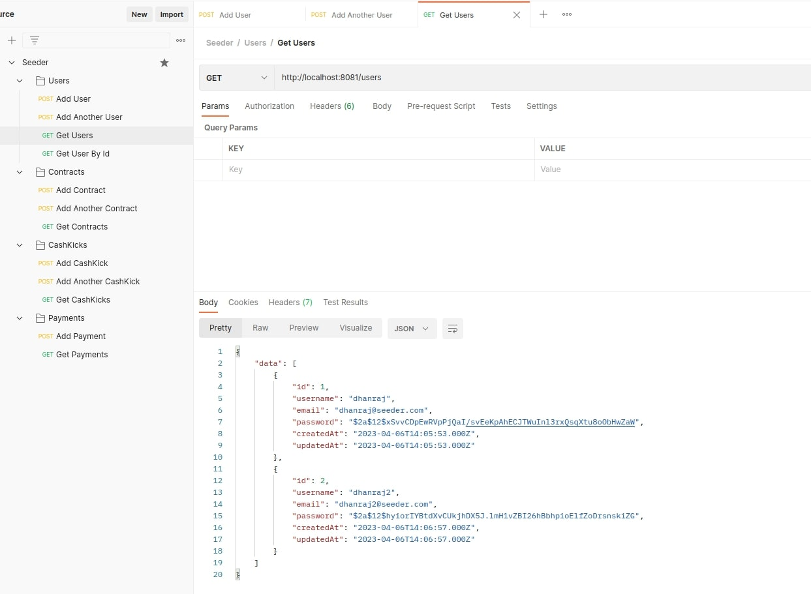

### GET /USER/{USERID}

- 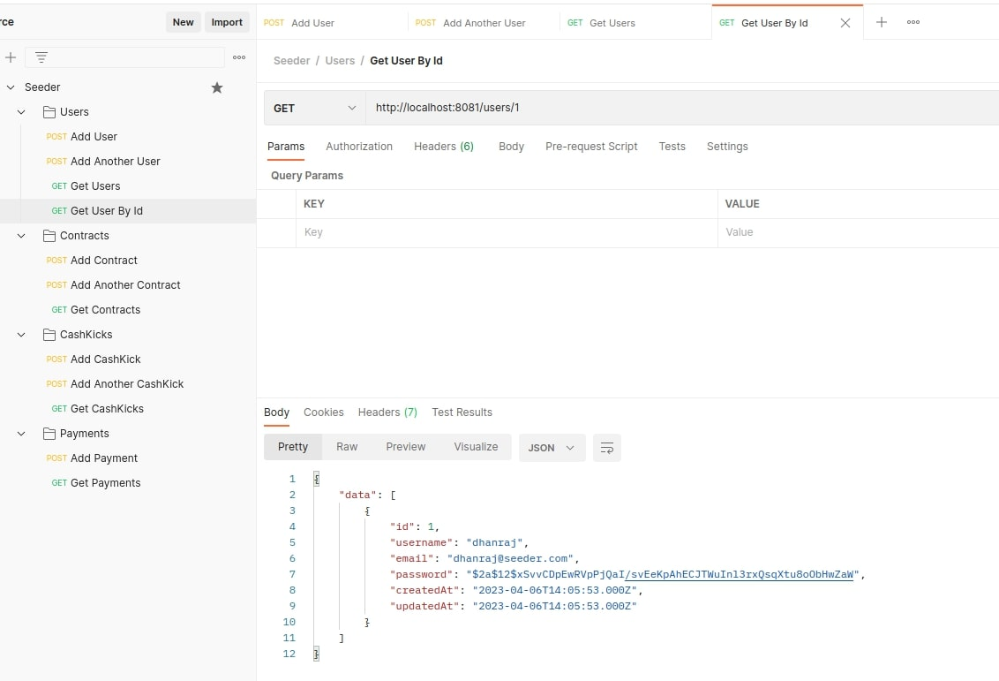

### POST /CASHKICK

- 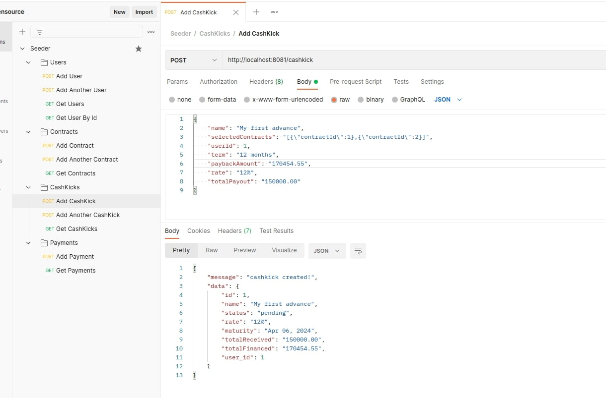
- 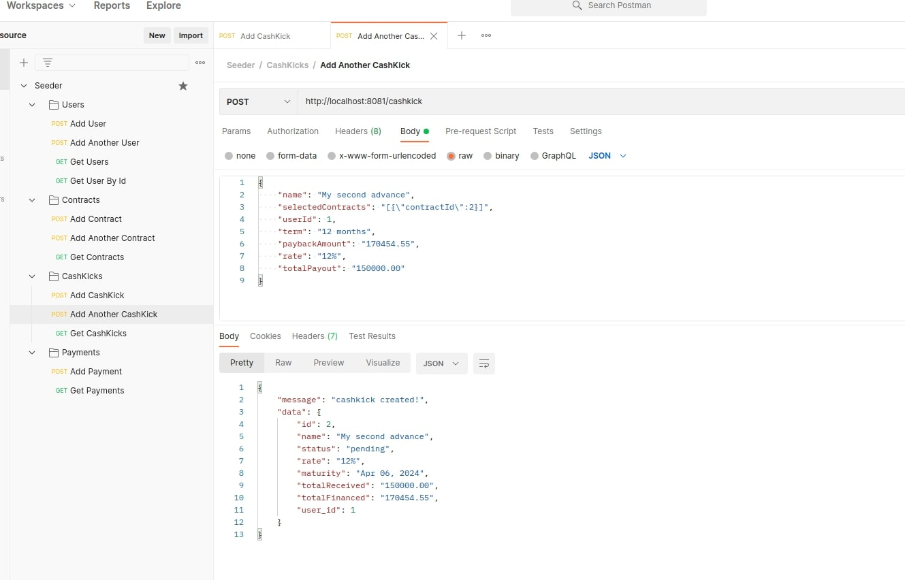

### GET /CASHKICK

- 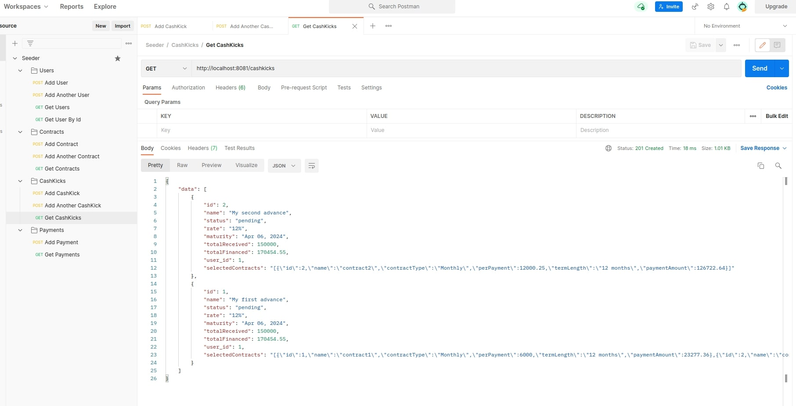

### POST /PAYMENT

- 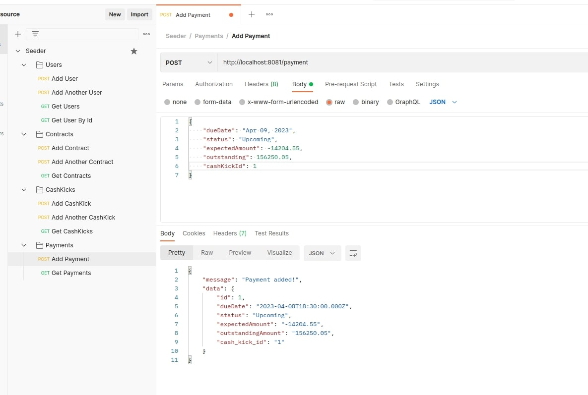

### GET /PAYMENT

- 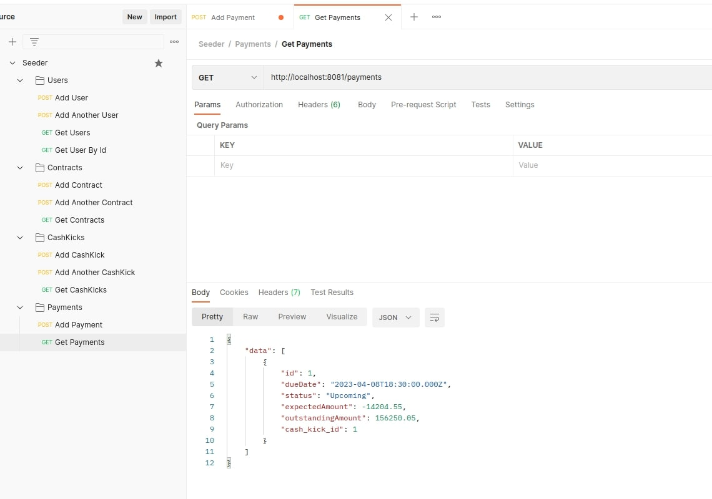

### POST /CONTRACT

- 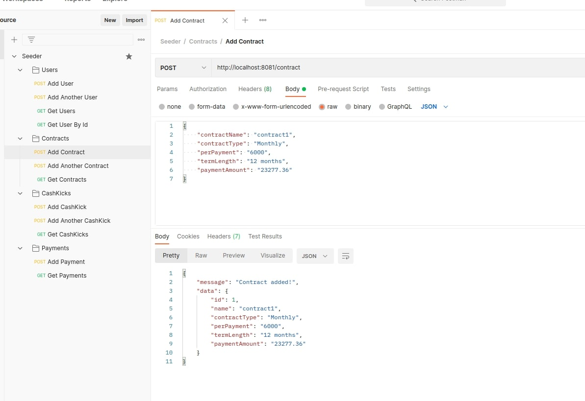
- 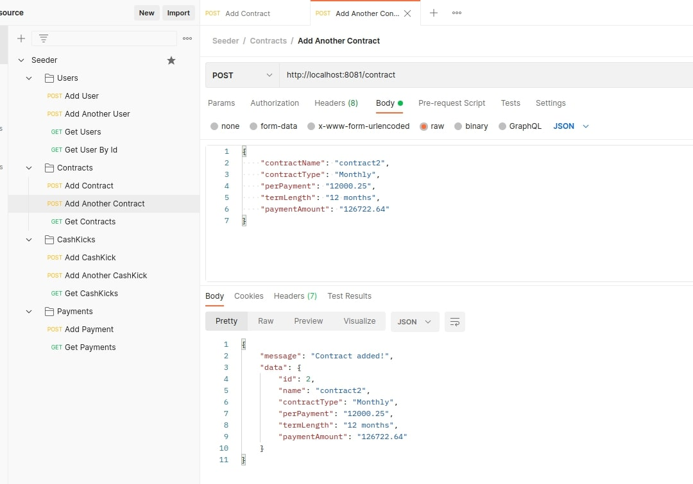

### GET /CONTRACT

- 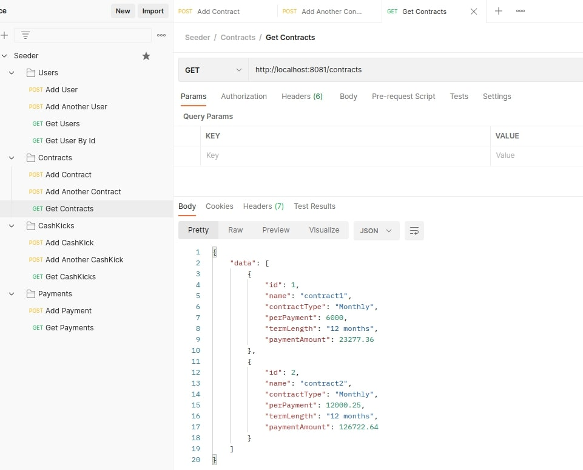
